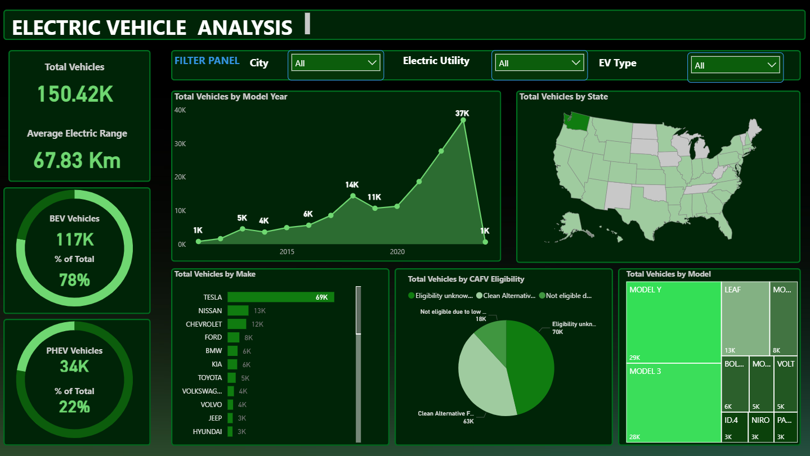

# Electric Vehicle Population Analysis
Welcome to my Power BI dashboard project! This analysis explores Electric Vehicle (EV) population data to uncover insights into adoption trends, vehicle types, and manufacturer impact. It's a hands-on demonstration of my Power BI skills — from data modeling to visual storytelling.
---
## Project Highlights
- **Tool Used**: Power BI Desktop  
- **Data Source**: [Electric_Vehicle_Population_Data.zip] (included as a zipped file in this repo)  
- **File Size Note**: Dataset is zipped to comply with GitHub’s upload limits.
---
## Dashboard Insights
This Power BI dashboard spans multiple reports, each offering deep insights into the EV landscape:
- Overview of EV population — total count, trends by year, and top-performing vehicle makes and models
- Geographic analysis — state/city-wise EV distribution and adoption heatmaps
- Fuel and drivetrain types — comparison between hybrid, electric, and plug-in models
- Manufacturer analysis — identifying top EV makers and their market shares
- Advanced filters — interactive slicers for make, model year, location, and fuel type
Each page is designed for interactivity and drill-through — allowing stakeholders to explore EV trends from multiple angles.
---
## Files in This Repo
- `Electric_Vehicle_Population_Data.zip` — Zipped dataset  
- `Electric Vehicle Analysis Dashboard.pbix` — Power BI report file  
- `EV_Dashboard_Snip.PNG` — Snapshot of the live dashboard  
---
## Dashboard Preview

---
## How to View This Project
1. **Download the zipped dataset** and unzip it
2. Open the `.pbix` file using **Power BI Desktop**
3. Explore the interactive dashboard and visuals
---
## Why This Project?
This is part of my transition into a career in Power BI & data analytics — building a portfolio that reflects not just technical skill, but the ability to present data with clarity and impact.
---
## Let’s Connect
Feel free to check out more projects or reach out:  
**GitHub**: [Farhana-FX1](https://github.com/Farhana-FX1)
---
> *“Data speaks when it’s given a voice. Here’s mine.”*
